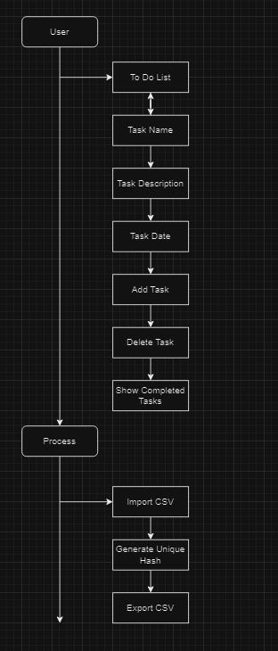
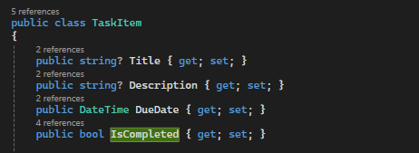

# U16A2

## Problem 1 - Design Documentation 

The client has requested that we create a Todo list that will allow for:

+ Creation and deletion of tasks 

+ Tracking done state and allowing tasks to be set to complete 

+ Supporting title, description, due date, completed with description and due date being mutable (note also requirement to change completion status above) 

+ Displaying a list of tasks 

+ Toggling whether all tasks or only incomplete tasks are displayed 

This program is primarily intended to be shown as a GUI application. The creation and deletion of tasks should be done using a button or similar element in the GUI, this will make the deletion and creation tasks a lot simpler for the users. This is also how we are going to make the task marked as completed is by using the same type of button as the add tasks and remove tasks. The way we will show that the complete tasks are being displayed with be with a check box that will be able to be toggled on and off. 

### Case Diagram



### Name Spaces and Libraries


Theses namespaces will have classes and methods that will be of use when it comes to creating this todo list. Some the methods and classes will help with UI controls data collection and property changing.

### Data Structure/Data Storage



This is how the todo list will be getting all of the information from the inputs that the user has done, this piece of code is getting the information from the user and then storing it in the correct place ready to be return later on to the user. 

## M2 Design Justification

### GUI Design

The GUI features are simplistic and pleasing to the eye, the GUI is clear on how to use the application as well as having buttons that are a good size as well as it being the main way that the user will interact with. The way the tasks are layed when using the application will be clear and easy to read. This meets the client requirements, the client requested that the application allow adding and deleting tasks as well as being able to mark tasks as complete and having a filter that will allow for only the completely tasks to be shown. However one improvement that could be made is to allow for the editing of tasks in the list this would allow for errors in information to be edited which would improve user happiness.


### Client Enhancements

In order to enhance the user experience and the client requirements, understanding what the client needs is quite important as he will be primary using this piece of software, continuously gaining feedback is how the client and other users of this software will be able to inform me with any bugs or issues that they have found. This is also a good way for get feedback on features that they would like to see be implemented in the future. This insures that the client is happy with the software going forward.

Another thing to do when creating this application was considering possible ways to enhance usability, one way of doing this is by adding controls that are intuitive and easy to use. This will make the application more user friendly and will make it easier for the client to use the software as well as increasing work flow. 

As the application is improves maintaining scalability is a really important thing, making sure that new features that you add to the application are able to added without interfering with the current features as well as supporting long term usability.

The GUI in my design is clear to use as well as the functionality ensures that the application is easy to use as well as the application being reliable and dependable. This application is improved by using interfaces this means the client can customise the application to their needs. This not only meets the client requirements but also makes the application more user friendly and will allow for the continued growth. Integrating data binding into the application will allow for the client to have a more interactive and responsive experience with the application.

### Data Binding

Using data binding in the GUI is important, this is because it ensures that the changing of the task data will automatically update in the user interface this removes the need for manual updates and making the usability of the application much better. This will keep the interfaces in sync with the data that is being used in the application. This will also allow for the client to have a more interactive and responsive experience with the application.

## Problem 1 - Development Documentation

When it comes to the application I have developed a simple todo list that will allow for the creation and deletion of tasks, WPF application (Windows Presentation Foundation).

### "MainWindow.xaml" Code

```xml
<Window x:Class="TaskEditor.MainWindow"
        xmlns="http://schemas.microsoft.com/winfx/2006/xaml/presentation"
        xmlns:x="http://schemas.microsoft.com/winfx/2006/xaml"
        xmlns:d="http://schemas.microsoft.com/expression/blend/2008"
        xmlns:mc="http://schemas.openxmlformats.org/markup-compatibility/2006"
        xmlns:local="clr-namespace:TaskEditor"
        mc:Ignorable="d"
        Title="To-Do List" Height="450" Width="800"
        Background="#ECFFFF">
    <Grid Margin="0,10,0,0">

        <Grid.ColumnDefinitions>
            <ColumnDefinition Width="2*" />
            <ColumnDefinition Width="*" />
        </Grid.ColumnDefinitions>

        <ListBox x:Name="TaskList" Grid.Column="0" Margin="277,10,10,10" SelectionMode="Single" Grid.ColumnSpan="2" Background="#ADD8E6"/>

        <StackPanel Margin="10,10,276,10">
            <TextBox x:Name="TitleBox" Text="Task Name" Margin="0,0,0,10" Background="#ADD8E6"/>
            <TextBox x:Name="DescriptionBox" Text="Task Description" Margin="0,0,0,10" Height="108" Background="#ADD8E6"/>
            <DatePicker x:Name="DueDatePicker" Margin="0,0,0,10" Background="#ADD8E6"/>
            <Button Content="Add Task to List" Click="AddTask_Click" Margin="0,0,0,10" Background="#ADD8E6"/>
            <Button Content="Delete Task from List" Click="DeleteTask_Click" Margin="0,0,0,10" Background="#ADD8E6"/>
            <Button Content="Mark as Finished" Click="MarkAsComplete_Click" Margin="0,0,0,10" Background="#ADD8E6"/>
            <CheckBox x:Name="ShowCompletedTasksCheckBox" Content="Show Finished Tasks" Checked="ShowCompletedTasks_Checked" Unchecked="ShowCompletedTasks_Checked"/>
        </StackPanel>

       
 
    </Grid>
</Window>


```

### "MainWindow.xaml.cs" Code

```csharp

using System;
using System.Collections.ObjectModel;
using System.Linq;
using System.Windows;
using System.Windows.Controls;

namespace TaskEditor
{
    public partial class MainWindow : Window
    {
        public ObservableCollection<TaskItem> Tasks { get; set; }

        public MainWindow()
        {
            InitializeComponent();
            Tasks = new ObservableCollection<TaskItem>();
            TaskList.ItemsSource = Tasks;
        }

        private void AddTask_Click(object sender, RoutedEventArgs e)
        {
            var newTask = new TaskItem
            {
                Title = TitleBox.Text,
                Description = DescriptionBox.Text,
                DueDate = DueDatePicker.SelectedDate ?? DateTime.Now,
                IsCompleted = false
            };
            Tasks.Add(newTask);
            ResetInputFields();
        }

        private void DeleteTask_Click(object sender, RoutedEventArgs e)
        {
            if (TaskList.SelectedItem is TaskItem selectedTask)
            {
                Tasks.Remove(selectedTask);
            }
        }

        private void MarkAsComplete_Click(object sender, RoutedEventArgs e)
        {
            if (TaskList.SelectedItem is TaskItem selectedTask)
            {
                selectedTask.IsCompleted = true;
                TaskList.Items.Refresh();
            }
        }

        private void ShowCompletedTasks_Checked(object sender, RoutedEventArgs e)
        {
            TaskList.ItemsSource = ShowCompletedTasksCheckBox.IsChecked == true
                ? Tasks
                : Tasks.Where(t => !t.IsCompleted);
        }

        private void ResetInputFields()
        {
            TitleBox.Text = string.Empty;
            DescriptionBox.Text = string.Empty;
            DueDatePicker.SelectedDate = null;
        }
    }

    public class TaskItem
    {
        public string? Title { get; set; }
        public string? Description { get; set; }
        public DateTime DueDate { get; set; }
        public bool IsCompleted { get; set; }

        public override string ToString()
        {
            return $"{Title} - {Description} - {(IsCompleted ? "Finished" : "Pending")} - Due: {DueDate.ToShortDateString()}";
        }
    }
}

```

### Test Plan

| Test Number | Expected Result                                                              | Actual Result     |
|-------------|------------------------------------------------------------------------------|-------------------|
| 1.          | When I click the add button it will  add the task to the list.               | Works as Intended |
| 2.          | When I click the delete button it will remove the task from the list.        | Works as intended |
| 3.          | When I select a date it will be added to the task                            | Works as intended |
| 4.          | When I click the marked as completed it will change the status of the task | Works as intended |
| 5.          | When using the show finished check box it will only show the finished tasks  | Works as intended |


## M3 Problem 1 Optimization

When it came to optimization I considered feedback from 2 peers

### Review and Feedback

#### Aiden Scowen

"Your solutions looks like they meet the requirements, both solutions are working as intended and the code is easy to read however i would suggest changing the colours around on the GUI as it looks a little weird." 

#### Ugnius Mieldazys

"Your solutions looks like they meet the requirements, both solutions are working and simple, the GUI looks good and the code is easy to read."

### Improvements based on feedback 

#### Aiden Scowen


I used data binding as it is a useful feature in WPF that will simplify the way that the data and UI are synchronized. This means that you will always have data that is both reflected in your data and in the UI elements ensuring that changes you are making in one are automatically updated in the UI that the user is seeing. This increases productivity for the user as well as improving the user experience as it provides real-time updates instead of a delay with what you are seeing and reducing the need for manual data manipilation. However when data binding is having to deal with large data or complex bindings it can lead to some proformance issues so it will be essential to optimize data binding operations to make sure that the application remains responsive. 

## Problem 2 - Design Documentation

The college library needs to add all its books to a new index system. The system will allow for reading CSV files and then generating a unique ID for the books then output them into a new CSV file.

### Pseudocode

BEGIN CSVProcessor

    FUNCTION Main
        SET inputFilePath TO "filepath\original.csv"
        SET outputFilePath TO "filepath\data.csv"

        READ all lines from inputFilePath INTO fileLines
        CREATE outputContent

        FOR EACH line IN fileLines
            SPLIT line by ',' INTO columns
            SET hashValue TO ComputeMD5Hash(columns)
            ADD line + "," + hashValue TO outputContent
        END FOR

        WRITE outputContent TO outputFilePath
        PRINT "CSV file processed successfully!"
    END FUNCTION

    FUNCTION ComputeMD5Hash(values)
        CONCATENATE values INTO concatenatedValues
        CONVERT concatenatedValues TO bytes dataBytes
        COMPUTE MD5 hash of dataBytes INTO hashBytes

        CREATE hashString FROM hashBytes AS hexadecimal string
        RETURN first 8 characters of hashString
    END FUNCTION

END CSVProcessor

### M2 Design Justification

The reason I have chosen to use hashing as a way of generating a unique ID for each book in the library is because it is basically impossible to generate the same hash for two different sets of data this will allow for you to generate unique hashes for each book with a different data set. You can also decide on how long you want the hash to be if you wish for a larger amount of data to be hashed in to a shorter form.

I used MD5 hasing because of the fact that it is quite a simple hashing alorgithm, this code is based on the fact that the data you are hashing is not sensitive which means that you don't need a more secure hashing solution. This is fine because we are only generating a unique ID for a book index meaning it doesnt need to be securiest hashing method, MD5 hashing will output a 128-bit hash which is a 32 character hexadecimal number meaning it can be easily turned into 8 ditgit number mumber. 

MD5 hashing is quite a old method for hashing numbers which means that it has be used and tested countless times and proven that it is a reliable way of hashing numbers. MD5 hashing is also supported by mulitple different coding languages.

## Problem 2 - Development Documentation 

```csharp

using System;
using System.IO;
using System.Security.Cryptography;
using System.Text;

class CSVProcessor
{
    static void Main()
    {
        string inputFilePath = @"..\..\..\Taskdata.csv";
        string outputFilePath = @"..\..\..\TaskdataUPDATED.csv";

        string[] fileLines = File.ReadAllLines(inputFilePath);

        StringBuilder outputContent = new StringBuilder();

        foreach (string line in fileLines)
        {
            string[] columns = line.Split(',');
            string hashValue = ComputeMD5Hash(columns);
            outputContent.AppendLine($"{line},{hashValue}");
        }

        File.WriteAllText(outputFilePath, outputContent.ToString());
        Console.WriteLine("CSV file processed successfully!");
    }

    static string ComputeMD5Hash(string[] values)
    {
        using (MD5 md5Hash = MD5.Create())
        {
            StringBuilder hashBuilder = new StringBuilder();
            string concatenatedValues = string.Join("", values);
            byte[] dataBytes = Encoding.UTF8.GetBytes(concatenatedValues);
            byte[] hashBytes = md5Hash.ComputeHash(dataBytes);

            foreach (byte b in hashBytes)
            {
                hashBuilder.Append(b.ToString("X2"));
            }

            return hashBuilder.ToString().Substring(0, 8);
        }
    }
}

```

### Test Plan

| Test Number | Expected Result                                | Actual Result              |
|-------------|------------------------------------------------|----------------------------|
| 1.          | The code can find the CSV file                 | The code can fine the file |
| 2.          | The code will output the info to a new CSV file | The code works as intended |
| 3.          | The code will generate a unique hash           | The code works as intended |
| 4.          | The hash will be not be different for repeats  | The code works as intended |
| 5.          | The code will output in the command line       | The code works as intended |


## M3 Problem 2 Optimization

The hashed value will always be the same hash code regardless of how many times you have hashed it, this is important when indexing items with unique IDs as it will gaurentee that the same inputs will always give the same outputs so using a reliable hashing algorithm like MD5 the application can rely on consistant hash codes for each serial number, enabling reliable data management and verification.

To optimize user experience when the code has read the CSV and rewrote all of the information into a new CSV file it will give the user a prompt in the command line saying "CSV file processed successfully"


To make the CSV file readiable for the user it will spit the columns by using commas inbetween seperating data.


## Evaluation

When it comes to the client requirements I have met all of the requirements for the client and have created an easy and simple solutions for the client. According to the feedback I have received the code is easy to read and the GUI looks good. I have also made the changes that were suggested to me by the feedback that I have received, this would be changing the colour theme of my GUI around.

The hardest part of the project was making sure the hash was unique however was also able to not have different hashes for the same data. The next issue was the GUI as it was difficult to make sure that it was working correctly. Then the buttons did not work as intended and had to be fixed.


 
optimisatioon
methods i used talk about a hashing alg why i used it, why itd secure, negatives also
talk about if things have the same hash, it wont matter cuz its the same
 
why was we needing data binding, why it wont work too well
